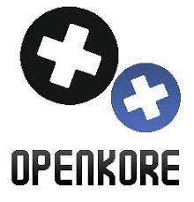

<p align="center">
  
  &nbsp;&nbsp;&nbsp;&nbsp;&nbsp;
  
</p>

# Arkan Relay

**Arkan Relay** is a modular C++20 relay that sits between the Ragnarok Online client and OpenKore, acting as a transparent bridge that intercepts, frames, and forwards game packets (TCP) to enable stable bot-side processing. The solution emphasizes Clean Architecture, with TOML-based configuration, spdlog-backed structured logging (file + rotation), and a GoogleTest/CTest suite. It is designed strictly for closed, lab-grade environments. This is not intended for use on third-party servers or in production contexts.

> This repository is being developed for study in a closed environment.

## 🧱 Architecture (Clean Architecture)

- **domain/**: pure models (e.g., `Settings`).
- **application/**: ports (interfaces) and orchestration services (e.g., `IConfigProvider`, `ILogger`).
- **infrastructure/**: concrete implementations of the ports (TOML via toml++, filesystem via Boost.Filesystem, logging via spdlog).
- **adapters/**: edges of the system.

Dependency direction (only inward):

```
domain  ←  application  ←  infrastructure  ←  adapters
```

### Folder layout

```
.
.
├─ arkan-relay.toml                 # default configuration (TOML)
├─ CMakeLists.txt
├─ scripts/
│  ├─ build.sh / build.ps1          # build (macOS/Linux / Windows)
│  └─ test.sh  / test.ps1           # run tests
├─ src/
│  ├─ domain/
│  │  └─ Settings.hpp
│  ├─ application/
│  │  ├─ ports/
│  │  │  ├─ IConfigProvider.hpp
│  │  │  ├─ ILogger.hpp
│  │  │  ├─ IHook.hpp
│  │  │  ├─ IKoreLink.hpp
│  │  │  └─ IFrameCodec.hpp         # keep as extension point (noop impl in infra)
│  │  └─ services/
│  │     ├─ BridgeService.hpp
│  │     └─ BridgeService.cpp
│  ├─ infrastructure/
│  │  ├─ config/
│  │  │  ├─ Config_Toml.hpp
│  │  │  └─ Config_Toml.cpp
│  │  ├─ logging/
│  │  │  ├─ Logger_Spdlog.hpp
│  │  │  └─ Logger_Spdlog.cpp
│  │  ├─ link/
│  │  │  ├─ KoreLink_Asio.hpp
│  │  │  └─ KoreLink_Asio.cpp
│  │  ├─ hook/
│  │  │  ├─ Hook_Win32.hpp          
│  │  │  └─ Hook_Win32.cpp
│  │  └─ codec/
│  │     └─ FrameCodec_Noop.hpp     # passthrough framing (placeholder)
│  └─ adapters/
│     └─ outbound/
│        └─ dll/
│           └─ DllMain.cpp          # DLL entrypoint (composition root)
└─ tests/
   ├─ test_config.cpp
   ├─ test_logger.cpp
   ├─ test_link_asio.cpp
   └─ test_bridge_integration.cpp
```

---

## ⚙️ Requirements

### Windows
- **Visual Studio 2022** (Desktop development with C++) or **MSVC Build Tools**
- **CMake** and (optional) **Ninja**
- Recommended: **vcpkg** (for dependency management)

#### Install vcpkg (Windows)
```powershell
# 1 - Clone vcpkg
git clone https://github.com/microsoft/vcpkg

# 2 - Build vcpkg
cd vcpkg
.\bootstrap-vcpkg.bat

# 3 - Add vcpkg to PATH
# Replace <path-to-vcpkg> with the folder where you cloned it
setx PATH "%PATH%;<path-to-vcpkg>"

# ⚠️ Close and reopen your terminal for the new PATH to take effect

# 4 Install dependencies (Manifest mode)
# At the project root (where vcpkg.json is located), run:
vcpkg install --triplet x86-windows
```

---

## 🛠️ Build

### Windows (PowerShell)

#### Using the build script (recommended)
```powershell
.\scripts\build.ps1 -Config Debug   # or Release
```

---

## 🧪 Tests

Run the tests (GoogleTest via CTest):

```bash
# Windows (PowerShell)
.\scripts\test.ps1 -Config Debug
```

Filter by name:
```bash
ctest --test-dir build -R ConfigToml --output-on-failure
```

---

## ▶️ Run the CLI

```bash
./build/arkan_relay_cli arkan-relay.toml
# or simply:
./build/arkan_relay_cli
# (if the file does not exist, it will be created with defaults)
```

---

## 🧩 Configuration (`arkan-relay.toml`)

**[general]**
- `ports` (array of integers): listening ports (e.g., `[6900, 6901, 6902]`).
- `showConsole` (bool): also output logs to the console.
- `saveLog` / `saveSocketLog` (bool): write logs to files for app/socket channels.

**[advanced]** *(optional)*
- `fnSeedAddr`, `fnChecksumAddr`, `fnSendAddr`, `fnRecvAddr`: hexadecimal addresses as strings (e.g., `"0x1234ABCD"`). Leave empty if unused.

**[logging]**
- `dir`: log directory (e.g., `"logs"`).
- `app`: application log filename.
- `socket`: socket channel log filename.

> **Log rotation:** 5 MB per file, 3 files per channel (see `Logger_Spdlog.cpp`).


## 💡 VS Code tips

- Extensions: **CMake Tools** and **C/C++** (ms-vscode.cpptools).
- Ensure IntelliSense uses `compile_commands.json`:
  ```json
  {
    "C_Cpp.default.configurationProvider": "ms-vscode.cmake-tools",
    "C_Cpp.default.compileCommands": "${workspaceFolder}/build/compile_commands.json",
    "C_Cpp.default.cppStandard": "c++20"
  }
  ```
- If you see false red squiggles on includes, reconfigure/clean:
  ```bash
  rm -rf build && ./scripts/build.sh
  ```
