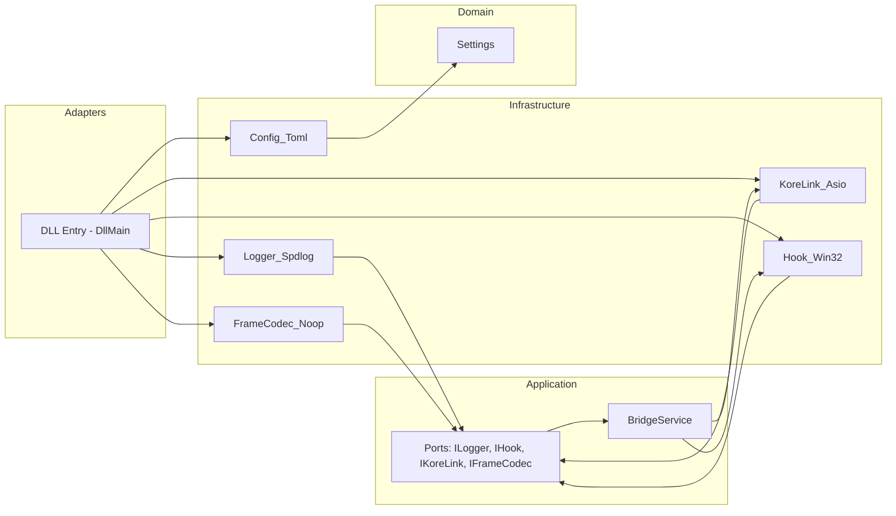

<p align="center">
  
  &nbsp;&nbsp;&nbsp;&nbsp;&nbsp;
  
</p>

<h1 align="center">Arkan Relay</h1>

<p align="center">
  <em>Modular C++20 relay that bridges the Ragnarok Online client and OpenKore for packet observation and controlled forwarding — built with Clean Architecture.</em><br/>
  <strong>For research in a closed/lab environment only.</strong>
</p>

---

## ✨ Overview

**Arkan Relay** runs as a Windows DLL that, once loaded into the Ragnarok Online (RO) client process, hooks the client’s `send`/`recv` functions to observe and (optionally) adjust packets. Frames are forwarded over TCP to a companion component (OpenKore side) using a minimal `R/S/K` envelope. It ships with:

- **Clean Architecture** (domain / application / infrastructure / adapters)
- **Config** via TOML (toml++)
- **Logging** via spdlog (file rotation + console + DebugView), with **colored console output**
- **Networking** via Boost.Asio
- **Unit tests** via GoogleTest/CTest
- **Windows-only hook** that patches function pointers safely using `VirtualProtect`

> ⚠️ This is a **research/educational** project. Do not use on third‑party servers or in production environments.

---

## 🧱 Architecture



**Dependency rule (inward only):** `domain ← application ← infrastructure ← adapters`.

---

## 🔧 How it works (Windows hook)

1. **DllMain** (process attach) starts a worker thread and opens an optional console.
2. The worker loads `arkan-relay.toml`, creates **Logger_Spdlog**, **KoreLink_Asio**, **FrameCodec_Noop**, and **Hook_Win32**.
3. **BridgeService** wires callbacks between the hook and the link.
4. **Hook_Win32::install()**:
   - Converts hex strings in `[advanced]` to absolute addresses inside the RO client process.
   - Uses `VirtualProtect` to flip slot memory to `PAGE_READWRITE`, **patches** the function-pointer slots for `send`/`recv` to point to our trampolines, then restores protection.
   - Stores the original function pointers to call-through and to restore on uninstall.
5. **Trampolines (hooked_send / hooked_recv)**:
   - Track a small state machine (e.g., special packets `0x1C 0x0B`, resets `0x26 0x0C`), optionally recomputing a trailing checksum byte via two exported functions (`seed`, `checksum`) whose addresses are also provided in config.
   - Emit **socket logs** and deliver byte spans to **BridgeService**, which frames and sends them to Kore.
6. On unload, the DLL signals the worker to stop; **BridgeService** shuts down, and the hook restores original pointers.

> The checksum/seed logic is implemented to mirror observed RO flows in a minimal, **non-invasive** way. All adjustments are gated by explicit state to avoid touching unrelated traffic.

---

## 📁 Layout

```
src/
├─ domain/Settings.hpp
├─ application/
│  ├─ ports/ (IConfigProvider, ILogger, IHook, IKoreLink, IFrameCodec)
│  └─ services/BridgeService.{hpp,cpp}
├─ infrastructure/
│  ├─ config/Config_Toml.{hpp,cpp}
│  ├─ logging/Logger_Spdlog.{hpp,cpp}
│  ├─ link/KoreLink_Asio.{hpp,cpp}
│  ├─ hook/Hook_Win32.{hpp,cpp}
│  └─ codec/FrameCodec_Noop.hpp
└─ adapters/outbound/dll/DllMain.cpp   ← composition root
tests/
```

---

## 🧪 Requirements

- **Windows 10/11**
- **Visual Studio 2022** (or **MSVC Build Tools 2022**)
- **CMake ≥ 3.26**
- **vcpkg** (manifest mode)

**Dependencies (via vcpkg):** `spdlog`, `tomlplusplus`, `boost-filesystem`, `boost-asio`, `gtest`.

---

## 📦 Setup (vcpkg)

```powershell
# 1) Clone and bootstrap vcpkg
git clone https://github.com/microsoft/vcpkg C:\vcpkg
C:\vcpkg\bootstrap-vcpkg.bat

# 2) Set environment
setx VCPKG_ROOT "C:\vcpkg"

# 3) From the project root (where vcpkg.json lives)
#    Install dependencies for 32-bit (matches project default triplet)
vcpkg install --triplet x86-windows --x-manifest-root=.
```

---

## 🛠️ Build

### PowerShell (recommended)

```powershell
# Configure + build
.\scripts\build.ps1 -Config Debug   # or Release
```

This script:
- Adds the vcpkg toolchain if `VCPKG_ROOT` is found
- Generates Visual Studio projects
- Builds the static lib, tests, and `ArkanRelay.dll`

> The project enables **/utf-8** and **colored console logging** by default.

---

## ✅ Tests

```powershell
.\scripts\test.ps1 -Config Debug
```

Filter tests:
```powershell
ctest --test-dir build -R KoreLinkAsio --output-on-failure -C Debug
```

---

## ⚙️ Configuration (`arkan-relay.toml`)

```toml
[logging]
showConsole     = true
saveLog         = true
saveSocketLog   = true
logsDir         = "logs"
appLogFilename  = "relay_app.log"
socketLogFilename = "relay_socket.log"

[kore]
host  = "127.0.0.1"
ports = [5293, 5294, 5295]

[kore.reconnect]
initial_ms = 500        # first break
max_ms     = 30000      # roof
backoff    = 2.0        # multiplier
jitter_p   = 0.2        # 20% jitter

[advanced]
# Absolute function-pointer slot addresses (hex strings).
# These are required for hook install():
fnSendAddr     = "0x01234567"   # address of a pointer slot to client send()
fnRecvAddr     = "0x89ABCDEF"   # address of a pointer slot to client recv()
# Exported functions used by the seed/checksum logic:
fnSeedAddr     = "0x00112233"
fnChecksumAddr = "0x00445566"
```

### Logging
- **File logs** rotate at 5 MB, keep 3 files per channel.
- **Console logs** are colorized by level. Enable/disable via `showConsole`.
- **DebugView**: messages also go through `OutputDebugString` (MSVC sink).

---

## 🖥️ Console logging (colors)

Console output is colored **per log level** (file logs remain plain). You can raise/lower verbosity at runtime via the `ILogger::set_level(LogLevel)` implementation in `Logger_Spdlog`.

Example:
```txt
[2025-07-08 19:35:22.101] [info] Arkan Relay bridge started.
[2025-07-08 19:35:22.601] [debug] SEND/RECV hooked successfully.
[2025-07-08 19:35:23.004] [trace] S 48 bytes → Kore
```

---

## 🧩 Using the DLL

- Build `ArkanRelay.dll`.
- Ensure `arkan-relay.toml` is accessible (same folder as the client or a known path).
- Load the DLL into the RO client process (for research only).
- On **PROCESS_ATTACH**, the DLL:
  - Opens a console (if `showConsole=true`)
  - Loads config, initializes logging
  - Connects to the configured Kore host/port
  - Installs the Windows hook
  - Starts bridging traffic

Stopping:
- Unload the DLL to trigger a graceful shutdown (the hook is uninstalled and links are closed).

> The repository **does not** include an injector. Loading the DLL is left to your lab setup.

---

## 🛡️ Safety & Scope

- Designed for **closed, controlled** environments only.
- Avoids invasive modifications by constraining checksum adjustments to explicitly detected flows.
- Uses RAII and minimal state to keep the hook reversible and testable.

---

## 📜 License

MIT — see `LICENSE`.

---

## 🙌 Acknowledgements

- [OpenKore](https://github.com/OpenKore/openkore) community
- spdlog, Boost, GoogleTest, toml++
- Microsoft vcpkg team

